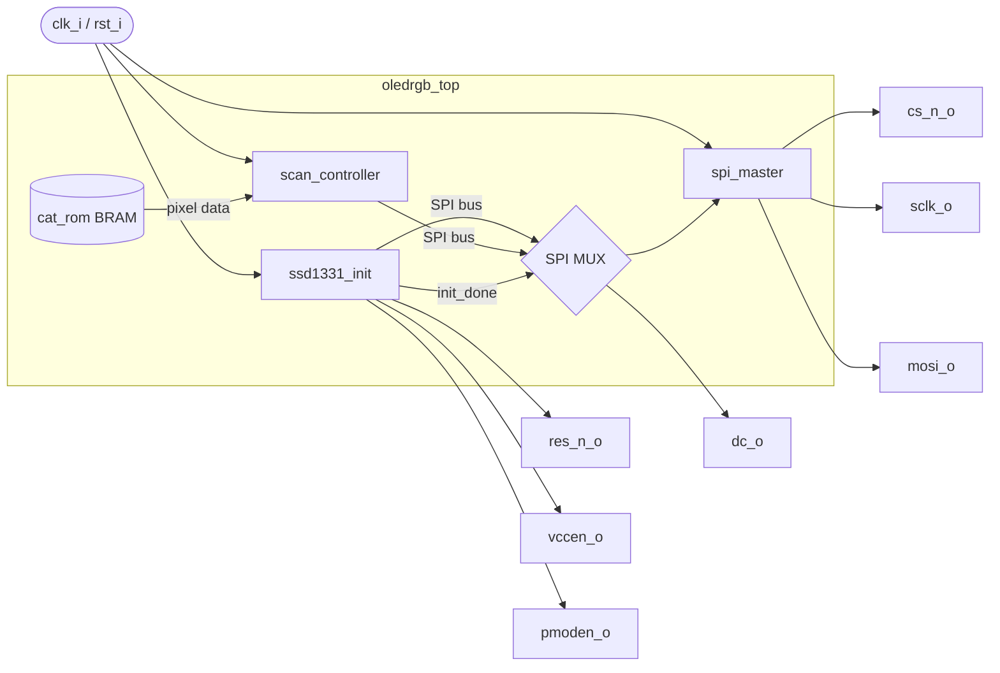

# VHDL OLED Driver — SSD1331 on Basys 3

VHDL driver for the [Digilent Pmod OLEDrgb](https://digilent.com/reference/pmod/pmodoledrgb/start) (SSD1331 controller, 96×64 RGB OLED) targeting the Digilent Basys 3 (Xilinx Artix-7). On power-up the display initialises itself and continuously refreshes a 96×64 RGB565 image stored in BRAM.

---

## Hardware

| Item | Detail |
|---|---|
| FPGA board | Digilent Basys 3 (Artix-7 XC7A35T) |
| Display | Digilent Pmod OLEDrgb (SSD1331) |
| Connector | Pmod JB |
| System clock | 100 MHz (W5) |
| Reset | BTNC centre button, active high |

### Pmod JB wiring

| JB pin | Signal | FPGA pin |
|--------|--------|----------|
| 1      | CS#    | A14 |
| 2      | MOSI (SDIN) | A16 |
| 3      | — (NC) | — |
| 4      | SCLK | B16 |
| 7      | D/C# | A15 |
| 8      | RES# | A17 |
| 9      | VCCEN | C15 |
| 10     | PMODEN | C16 |

---

## Architecture



### Startup sequence

1. **PMODEN_START** — assert PMODEN, wait 20 ms for logic supply stabilization
2. **RST_LOW / RST_HIGH** — pulse RES# low for 3 µs, then release
3. **SND_CONF** — send 38 SSD1331 configuration bytes over SPI
4. **VCCEN_WAIT** — assert VCCEN, wait 25 ms for OLED power stabilization
5. **SND_DISP** — send `0xAF` (Display ON)
6. **DELAY_100MS** — wait 100 ms post-power-on
7. **DONE** — assert `done_o`, hand off SPI bus to `scan_controller`

Once initialisation completes, `scan_controller` takes over and continuously streams full frames to the display.

### SPI MUX

`ssd1331_init` and `scan_controller` share a single `spi_master` instance. A registered flag (`init_done_latch_s`) latches when init completes and gates a combinational MUX that switches SPI ownership from init to scan.

---

## Repository layout

```
.
├── src/
│   ├── spi_master.vhd        # SPI master, Mode 3 (CPOL=1 CPHA=1), 50 MHz, MSB first
│   ├── ssd1331_init.vhd      # Initialisation state machine
│   ├── scan_controller.vhd   # Continuous frame refresh state machine
│   ├── cat_rom.vhd           # Demo image ROM (generated — see img_to_rom/)
│   └── oledrgb_top.vhd       # Top-level, wires all modules together
├── tb/
│   ├── spi_master_tb.vhd
│   ├── ssd1331_init_tb.vhd
│   └── scan_controller_tb.vhd
├── img_to_rom/
│   ├── png_to_rom.py         # PNG → VHDL ROM package converter
│   └── cat.png               # Demo source image (96×64)
├── pinout/
│   └── oledrgb_top.xdc       # Vivado constraints (Basys 3, Pmod JB)
├── sim/
│   └── result.gtkw           # GTKWave session for spi_master_tb
└── Makefile
```

---

## Getting started

### Prerequisites

- [GHDL](https://github.com/ghdl/ghdl) ≥ 3.0 (simulation)
- [GTKWave](https://gtkwave.sourceforge.net/) (optional, waveform viewer)
- [Vivado](https://www.xilinx.com/products/design-tools/vivado.html) (synthesis and programming)
- Python 3.10+ with [Pillow](https://pillowpython.com/) (`pip install pillow`) — only for image conversion

### Simulate

```bash
make          # analyse, elaborate, and run all three testbenches
```

Each testbench produces a `.fst` waveform file and a `.log` in the project root.

```bash
make wave TB=spi_master_tb      # open a specific waveform in GTKWave
make wave TB=ssd1331_init_tb
make wave TB=scan_controller_tb
```

Expected output (all tests must pass with no `error` severity messages):

```
tb/spi_master_tb.vhd:...: Simulation complete
tb/ssd1331_init_tb.vhd:...: OK: init sequence complete
tb/scan_controller_tb.vhd:...: OK: scan_controller validated
```

### Synthesize with Vivado

1. Create a new Vivado project targeting `xc7a35tcpg236-1` (Basys 3).
2. Add all files under `src/` as design sources.
3. Add `pinout/oledrgb_top.xdc` as a constraint file.
4. Set `oledrgb_top` as the top module.
5. Run **Generate Bitstream** and program the board.

---

## Using your own image

The `img_to_rom/png_to_rom.py` script converts any PNG to a VHDL ROM package in RGB565 format. Images that are not 96×64 are automatically resized.

```bash
cd img_to_rom
python3 png_to_rom.py my_image.png -o my_image_rom.vhd
cp my_image_rom.vhd ../src/
```

The script generates a package named after the output file (e.g. `my_image_rom_pkg`). Update the import in `oledrgb_top.vhd`:

```vhdl
use work.my_image_rom_pkg.all;
```

---

## Module reference

### `spi_master`

| Port | Dir | Description |
|------|-----|-------------|
| `clk_i` | in | 100 MHz system clock |
| `rst_i` | in | Async reset, active high |
| `start_i` | in | Single-cycle pulse to begin transfer |
| `data_i[7:0]` | in | Byte to transmit, MSB first |
| `sclk_o` | out | SPI clock, 50 MHz, idle high (CPOL=1) |
| `mosi_o` | out | SPI data out |
| `cs_n_o` | out | Chip select, active low |
| `busy_o` | out | High during transfer |
| `done_o` | out | Single-cycle pulse on completion |

### `ssd1331_init`

| Port | Dir | Description |
|------|-----|-------------|
| `start_i` | in | Begin init sequence (tied to `'1'` in top-level) |
| `res_n_o` | out | Display reset, active low |
| `vccen_o` | out | OLED power enable |
| `pmoden_o` | out | Pmod power enable |
| `dc_o` | out | Data/Command select (always `'0'` during init) |
| `spi_data_o` / `spi_start_o` / `spi_busy_i` | — | SPI master interface |
| `done_o` | out | Single-cycle pulse when init is complete |

### `scan_controller`

| Port | Dir | Description |
|------|-----|-------------|
| `start_i` | in | Single-cycle pulse to begin streaming |
| `pixel_addr_o[12:0]` | out | Pixel index (0–6143), registered for BRAM |
| `pixel_data_i[15:0]` | in | RGB565 pixel from ROM/BRAM |
| `dc_o` | out | `'0'` for window header bytes, `'1'` for pixel data |
| `done_o` | out | Single-cycle pulse after each full frame |

Each frame starts with a 6-byte window command (Set Column / Set Row Address), followed by 6144×2 bytes of pixel data. `done_o` pulses once per frame; the controller immediately restarts for continuous refresh.

---

## License

MIT
